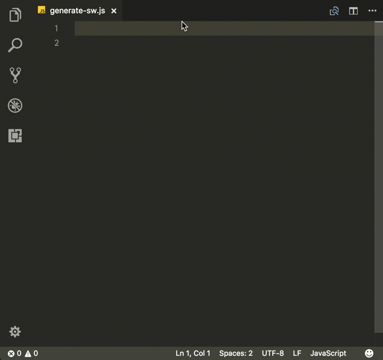

# VS Code Extension for PWA Tooling
VS Code Extension for PWA Tools

This extension for Visual Studio Code adds snippets and JSON schema for a `manifest.json` for creating Progressive Web Apps (PWA).

**THIS IS AN ALPHA VERSION**



See the [CHANGELOG](CHANGELOG.md) for the latest changes

## Usage
Type part of a snippet, press `enter`, and the snippet unfolds.

### JavaScript Snippets
```javascript
pwa-inject-precache       // inject precache list into service worker
pwa-service-worker        // create a service worker
```

### HTML Snippets
```javascript
pwa-manifest              // create the link to the manifest.json
```

### TypeScript Snippets
```javascript
pwa-register              // function that registers the service worker
```

### JSON Snippets
```javascript
pwa-manifest              // * ccreate tjhe contents of `manifest.json`
```

Alternatively, press `Ctrl`+`Space` (Windows, Linux) or `Cmd`+`Space` (OSX) to activate snippets from within the editor.

## Installation

1. Install Visual Studio Code 1.10.0 or higher
2. Launch Code
3. From the command palette `Ctrl`-`Shift`-`P` (Windows, Linux) or `Cmd`-`Shift`-`P` (OSX)
4. Select `Install Extension`
5. Choose the extension
6. Reload Visual Studio Code

